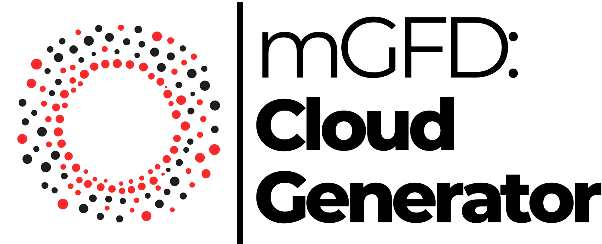

<p align="center" width="100%">
   
</p>

# mGFD: Cloud Generator :rocket: :cloud:

mGFD: Cloud Generator was designed by the Malla group at the Universidad Michoacana de San Nicolás de Hidalgo to bring an easy way to create clouds for irregular domains to compare different methods to numerically solve partial differential equations without a structured mesh.

## Features :sparkles:

- **:framed_picture: ContourCreator**: Upload an image to generate contours for your projects.
- **:bar_chart: CloudGen**: Upload a CSV file to produce point clouds for irregular domains.
- **:hammer_and_wrench: CloudMod**: Modify and refine existing clouds by uploading CSV files.
- **:computer_mouse: User-Friendly Interface**: Drag-and-drop functionality for seamless file uploads.
- **:iphone: Responsive Design**: Optimized for desktop and mobile devices.

## Deployment :earth_americas:

A live deployment of this repository is available for academic and testing purposes. You can access it at:

:link: [mGFD: Cloud Generator Deployment](https://malla.umich.mx/CloudGen/)

## Installation :hammer_and_wrench:

To run this application locally, follow these steps:

1. Clone this repository:
   ```bash
   git clone https://github.com/gstinoco/CloudGen.git
   cd CloudGen
   ```

2. Create a virtual environment and activate it:
   ```bash
   python3 -m venv venv
   source venv/bin/activate  # On Windows, use `venv\Scripts\activate`
   ```

3. Install the required dependencies:
   ```bash
   pip install -r requirements.txt
   ```

4. Run the application:
   ```bash
   flask run
   ```

5. Open your browser and navigate to:
   ```
   http://127.0.0.1:5000
   ```

## Project Structure :open_file_folder:

```
CloudGen/
├── app.py                # Main application file
├── requirements.txt      # Python dependencies
├── LICENSE               # License information
├── static/               # Static files (CSS, JS, images, etc.)
├── templates/            # HTML templates
└── README.md             # Project documentation
```

## License :scroll:

This project is licensed under the terms specified in the `LICENSE` file.

## Acknowledgments :raised_hands:

This application was developed by the Malla group at the Universidad Michoacana de San Nicolás de Hidalgo. Special thanks to the contributors and researchers involved in the project.

## Contributing :handshake:

Contributions are welcome! If you find any issues or have ideas for improvements, feel free to open an issue or submit a pull request.

---

We hope mGFD: Cloud Generator becomes a valuable tool for your numerical analysis and research projects. :rocket: