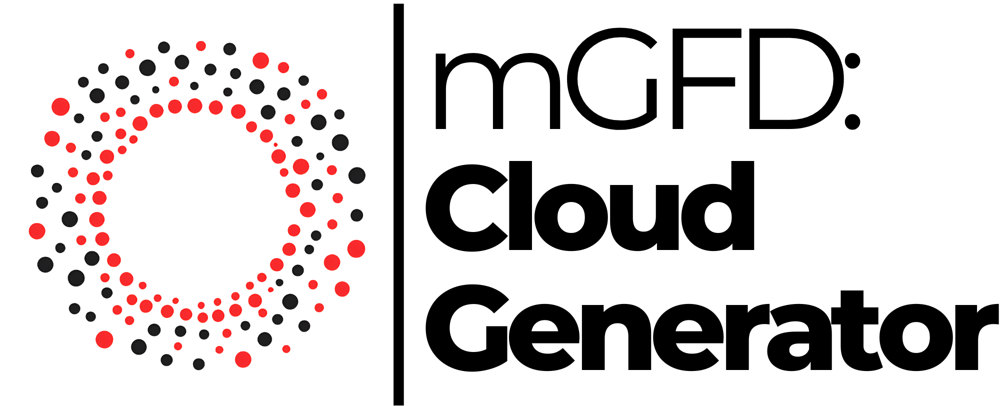

# mGFD CloudGenerator 2.0 :cloud:

<div align="center">



</div>

<div align="center">

[](https://github.com/gstinoco/CloudGen) [](https://www.python.org/downloads/) [](https://flask.palletsprojects.com/) [](https://opencv.org/) [](https://numpy.org/) [](https://opensource.org/licenses/MIT)

**Advanced Web Platform for Generating Unstructured Clouds of Points**

*Complete solution for meshless Generalized Finite Difference Method (mGFD) applications*

### :link: Quick Links
[](https://malla.umich.mx/CloudGenerator/) [](#rocket-quick-start) [](#sparkles-features) [](#scientist-research-team)

</div>

---

## :clipboard: Table of Contents
- [Overview](#star2-overview)
- [Features](#sparkles-features)
- [Installation & Setup](#package-installation--setup)
- [Quick Start](#rocket-quick-start)
- [Usage Guide](#book-usage-guide)
- [API Documentation](#gear-api-documentation)
- [Examples](#bulb-examples)
- [Project Architecture](#open_file_folder-project-architecture)
- [Configuration](#wrench-configuration)
- [Scientific Background](#books-scientific-background)
- [Contributing](#handshake-contributing)
- [Research Team](#scientist-research-team)
- [Commercial Sponsors](#handshake-commercial-sponsors)
- [Acknowledgments](#pray-acknowledgments)
- [Citation & License](#memo-citation--license)
- [Contact](#email-contact--support)

---

## :star2: Overview

The **mGFD CloudGenerator 2.0** is a comprehensive web-based platform designed for generating optimized unstructured clouds of points specifically tailored for the meshless Generalized Finite Difference Method (mGFD). This advanced tool combines interactive image processing capabilities with sophisticated cloud generation algorithms to provide researchers and engineers with a complete solution for numerical simulations.

> :globe_with_meridians: **Try it now!** A stable live demo is available at: **[https://malla.umich.mx/CloudGenerator/](https://malla.umich.mx/CloudGenerator/)** <mcreference link="https://malla.umich.mx/CloudGenerator/" index="0">0</mcreference>

### :gear: Key Capabilities
- **:art: Interactive Contour Creation**: Advanced image segmentation with multiple algorithms (Watershed, GrabCut, Interactive, Region Growing)
- **:cloud: Optimized Cloud Generation**: High-quality point cloud generation with Regular and Natural Distribution algorithms
- **:chart_with_upwards_trend: Real-time Visualization**: Interactive canvas with zoom, pan, brush-based refinement, and multi-region support
- **:floppy_disk: Multiple Export Formats**: CSV data export with PNG/SVG visualizations and statistical analysis
- **:globe_with_meridians: Web-based Interface**: Modern, responsive design with asynchronous processing and Web Workers

### :microscope: Applications

| Field | Application | Use Case |
|-------|-------------|----------|
| **Computational Fluid Dynamics** :ocean: | Flow Simulation | Irregular domain discretization, boundary layer modeling |
| **Structural Engineering** :building_construction: | Stress Analysis | Complex geometry meshing, crack propagation studies |
| **Heat Transfer** :fire: | Thermal Analysis | Non-uniform domain discretization, interface problems |
| **Environmental Modeling** :herb: | Pollution Transport | Irregular terrain modeling, contaminant dispersion |
| **Biomedical Engineering** :microscope: | Tissue Modeling | Organ geometry discretization, drug delivery simulation |

---

## :sparkles: Features

### :art: ContourCreator Module
- **Interactive Image Processing**: Upload and process images (PNG, JPG, JPEG, GIF, BMP, TIFF)
- **Advanced Segmentation Algorithms**: Watershed, GrabCut, Interactive Segmentation, and Region Growing
- **Brush-based Refinement**: Manual editing tools for precise contour adjustment
- **Multi-region Management**: Detect, add, remove, and modify multiple regions with color-coded visualization
- **Canvas Operations**: Zoom, pan, precise click-based region selection with coordinate tracking
- **Real-time Preview**: Instant visualization of detected contours with interactive feedback

### :cloud: CloudGenerator Module
- **Advanced Distribution Algorithms**: Regular and Natural Distributions
- **Multi-region Processing**: Intelligent node classification (interior, boundary, interface nodes)
- **CSV File Processing**: Upload validation, data parsing, and coordinate optimization
- **Real-time Visualization**: Interactive scatter plots with statistical analysis and progress tracking
- **Asynchronous Processing**: Background cloud generation with Web Workers and real-time status updates
- **Multiple Export Formats**: CSV data files with high-resolution PNG and scalable SVG visualizations

### :globe_with_meridians: Web Interface
- **Modern Design**: Responsive interface with glassmorphism effects and smooth animations
- **Drag & Drop**: Intuitive file upload with progress indicators and validation
- **Real-time Feedback**: Live status updates, error handling, and progress tracking
- **Professional Logging**: Comprehensive logging system with file rotation and debugging
- **Cross-platform**: Compatible with all modern web browsers and operating systems

### :gear: Advanced Technical Features

#### Image Processing & Segmentation
- **Multiple Algorithms**: Watershed, GrabCut, Interactive Segmentation, Region Growing
- **Brush Tools**: Manual refinement with customizable brush sizes and opacity
- **Format Support**: PNG, JPG, JPEG, GIF, BMP, TIFF with automatic format detection
- **Canvas Operations**: Zoom, pan, coordinate tracking, and real-time preview

#### Cloud Generation Algorithms
- **Regular Distribution**: Uniform point spacing with customizable density
- **Natural Distribution**: Poisson Disk Sampling for organic point placement
- **Multi-region Processing**: Intelligent handling of complex geometries
- **Statistical Analysis**: Point distribution metrics and quality assessment

#### Data Processing & Export
- **CSV Processing**: Advanced parsing, validation, and optimization
- **Multiple Formats**: CSV data files, PNG visualizations, SVG vector graphics
- **Point Reduction**: Uniform, Multiple, and Filtered reduction algorithms
- **Quality Preservation**: Maintains geometric integrity during processing

---

## :package: Installation & Setup

### :computer: System Requirements

| Component | Minimum | Recommended |
|-----------|---------|-------------|
| **Python** | 3.8+ | 3.9+ |
| **RAM** | 4 GB | 8 GB+ |
| **CPU** | 2 cores | 4+ cores |
| **Storage** | 1 GB | 5 GB+ (for datasets) |
| **OS** | Windows/Linux/macOS | Linux (optimal performance) |

### :package: Dependencies

The project uses the following main dependencies:

```python
# Core web framework
Flask >= 2.3.0               # Web application framework
Werkzeug >= 2.3.0            # WSGI utilities

# Computer vision and image processing
opencv-python >= 4.8.0       # Image processing and segmentation algorithms
Pillow >= 10.0.0             # Image manipulation and format support

# Scientific computing
numpy >= 1.24.0              # Numerical computations and array operations
shapely >= 2.0.0             # Geometric operations and computational geometry

# Additional utilities
threading                    # Asynchronous processing support
logging                      # Comprehensive logging system
```

### :wrench: Installation Steps

#### Method 1: Direct Installation
```bash
# Clone the repository
git clone https://github.com/gstinoco/CloudGen.git
cd CloudGen

# Install dependencies
pip install -r requirements.txt
```

#### Method 2: Virtual Environment (Recommended)
```bash
# Create virtual environment
python -m venv mGFD_env
source mGFD_env/bin/activate  # On Windows: mGFD_env\Scripts\activate

# Clone and install
git clone https://github.com/gstinoco/CloudGen.git
cd CloudGen
pip install -r requirements.txt
```

#### Method 3: Conda Environment
```bash
# Create conda environment
conda create -n mGFD_cloudgen python=3.9
conda activate mGFD_cloudgen

# Clone and install
git clone https://github.com/gstinoco/CloudGen.git
cd CloudGen
pip install -r requirements.txt
```

### :white_check_mark: Installation Verification

```bash
# Test installation
python -c "import flask, cv2, numpy; print('✅ Installation successful!')"

# Run the application
python app.py
```

The application will be available at `http://localhost:8080`

---

## :rocket: Quick Start

### 1. :arrow_forward: Launch the Application

```bash
# Navigate to project directory
cd mGFD-CloudGenerator

# Start the web server
python app.py
```

### 2. :art: Create Contours (ContourCreator)

1. **Upload Image**: Navigate to ContourCreator and upload your image
2. **Detect Regions**: Click on regions of interest to detect contours
3. **Manage Regions**: Add, remove, or modify detected regions
4. **Export Data**: Save coordinates as CSV files

### 3. :cloud: Generate Point Clouds (CloudGenerator)

1. **Upload CSV**: Use the CSV file from ContourCreator or upload your own
2. **Configure Parameters**: Set generation options (regions inside/outside)
3. **Generate Cloud**: Start the cloud generation process
4. **Download Results**: Get CSV data and visualization files

### 4. :chart_with_upwards_trend: Analyze Results

- **CSV Files**: Node coordinates with region classification
- **PNG Images**: High-resolution visualizations
- **SVG Files**: Scalable vector graphics for publications

---

## :book: Usage Guide

### ContourCreator Workflow

#### Step 1: Image Upload
```javascript
// Supported formats: PNG, JPG
// Maximum file size: 10MB
// Drag & drop or click to browse
```

#### Step 2: Region Detection
- Click on image regions to detect contours
- Adjust tolerance for segmentation sensitivity
- Use zoom and pan for precise selection
- Multiple regions supported with color coding

#### Step 3: Region Management
- **Add Region**: Click "Add Region" after detection
- **Toggle Visibility**: Show/hide regions individually
- **Delete Region**: Remove unwanted regions
- **Clear All**: Reset all detected regions

#### Step 4: Data Export
- **Single Region**: Export individual region coordinates
- **All Regions**: Export complete dataset with region labels
- **CSV Format**: Normalized coordinates (0-1 range)

### CloudGenerator Workflow

#### Step 1: CSV Upload
```csv
# Expected CSV format:
x,y,region
0.1,0.2,1
0.3,0.4,1
0.5,0.6,2
```

#### Step 2: Configuration
- **Regions Inside**: Generate points inside detected regions
- **Regions Outside**: Generate points outside detected regions
- **Adaptive Sizing**: Automatic point density optimization

#### Step 3: Generation Process
- **Asynchronous Processing**: Background generation with status updates
- **Memory Management**: Optimized for large datasets
- **Error Handling**: Comprehensive error reporting

#### Step 4: Results
- **Node Classification**: Interior, boundary, and interface nodes
- **Multiple Formats**: CSV data with PNG/SVG visualizations
- **Quality Metrics**: Point distribution analysis

---

## :open_file_folder: Project Architecture

```
mGFD-CloudGenerator/
├── 📄 app.py                    # Main Flask application
├── 📄 cloud_generation.py       # Cloud generation algorithms
├── 📄 reduce_points.py          # Point reduction utilities
├── 📄 requirements.txt          # Python dependencies
├── 📁 templates/                # HTML templates
│   ├── 🏠 home.html             # Landing page
│   ├── 🎨 contour_creator.html  # ContourCreator interface
│   ├── ☁️ cloud_generator.html  # CloudGenerator interface
│   └── ℹ️ about.html            # About page
├── 📁 static/                   # Static assets
│   ├── 🎨 css/styles.css        # Main stylesheet (6000+ lines)
│   ├── 📜 js/                   # JavaScript modules
│   │   ├── contour_creator.js   # ContourCreator functionality
│   │   ├── cloud_generator.js   # CloudGenerator functionality
│   │   └── navbar.js            # Navigation components
│   ├── 🖼️ images/               # Logos and assets
│   └── 📊 examples/             # Sample data files
├── 📁 uploads/                  # Temporary file storage
├── 📁 output/                   # Generated results
└── 📁 logs/                     # Application logs
```

### Core Modules

#### Flask Application (`app.py`)
- **Web Framework**: Flask-based REST API
- **File Management**: Upload handling and cleanup
- **Image Processing**: OpenCV integration for segmentation
- **Async Processing**: Background task management
- **Logging System**: Professional logging with rotation

#### Cloud Generation (`cloud_generation.py`)
- **Advanced Distribution Algorithms**: Regular and Natural Distributions
- **Multi-region Processing**: Intelligent boundary data processing for mGFD method
- **Node Classification**: Interior/boundary/interface detection with automatic classification
- **Memory Management**: Efficient processing for large datasets with optimization
- **Visualization**: High-quality PNG/SVG output with statistical analysis

#### Point Reduction (`reduce_points.py`)
- **Multiple Reduction Algorithms**: Uniform, Multiple, and Filtered reduction methods
- **CSV Processing**: Advanced point reduction functionality for cloud data optimization
- **Quality Preservation**: Maintains geometric integrity while reducing point density
- **Flexible Configuration**: Customizable reduction parameters for different use cases

#### Contour Detection (`contour_detection.py`)
- **Advanced Segmentation**: Watershed, GrabCut, Interactive, and Region Growing algorithms
- **Brush-based Refinement**: Manual editing tools for precise boundary adjustment
- **Multi-format Support**: Comprehensive image format compatibility (PNG, JPG, TIFF, etc.)
- **Real-time Processing**: Interactive segmentation with immediate visual feedback

#### Frontend (`static/`)
- **Modern UI**: Responsive design with CSS Grid/Flexbox
- **Interactive Canvas**: HTML5 Canvas with zoom/pan capabilities
- **Real-time Updates**: WebSocket-like status monitoring
- **File Handling**: Drag & drop with progress indicators

---

## :handshake: Contributing

We welcome contributions from the research community! Here's how you can help:

### :bug: Bug Reports
1. **Search Existing Issues**: Check if the bug has been reported
2. **Create Detailed Report**: Include steps to reproduce, expected vs actual behavior
3. **Provide Context**: Operating system, Python version, browser details
4. **Include Logs**: Attach relevant log files from the `logs/` directory

### :bulb: Feature Requests
1. **Describe the Feature**: Clear description of the proposed functionality
2. **Justify the Need**: Explain how it benefits the research community
3. **Provide Examples**: Include use cases and expected behavior
4. **Consider Implementation**: Suggest possible approaches if applicable

### :computer: Code Contributions

#### Development Setup
```bash
# Fork the repository
git clone https://github.com/yourusername/CloudGen.git
cd CloudGen

# Create development environment
python -m venv dev_env
source dev_env/bin/activate
pip install -r requirements.txt

# Create feature branch
git checkout -b feature/your-feature-name
```

#### Coding Standards
- **Python Style**: Follow PEP 8 guidelines
- **Documentation**: Include comprehensive docstrings
- **Testing**: Add unit tests for new functionality
- **Logging**: Use the existing logging framework
- **Error Handling**: Implement robust error handling

#### Pull Request Process
1. **Update Documentation**: Ensure README and docstrings are current
2. **Test Thoroughly**: Verify functionality across different scenarios
3. **Follow Conventions**: Maintain consistent code style
4. **Describe Changes**: Provide clear PR description with examples

### :memo: Documentation
- **API Documentation**: Help improve endpoint documentation
- **User Guides**: Create tutorials and usage examples
- **Scientific Papers**: Contribute to research publications
- **Translations**: Help translate documentation to other languages

---

## :busts_in_silhouette: Research Team

<div align="center">

### :star2: **Meet Our Research Team**
*Interdisciplinary experts advancing meshless computational methods*

</div>

---

### :microscope: **Principal Researchers**

<div align="center">

<table>
<tr>
<td align="center" width="33%">


**Dr. Gerardo Tinoco-Guerrero**  
*Principal Researcher & Project Director*

[](mailto:gerardo.tinoco@umich.mx)
[](https://orcid.org/)
[](https://www.researchgate.net/)

</td>
<td align="center" width="33%">


**Dr. José Alberto Guzmán-Torres**  
*Co-Researcher & Technical Lead*

[](mailto:jose.alberto.guzman@umich.mx)
[](https://orcid.org/)
[](https://www.researchgate.net/)

</td>
<td align="center" width="33%">


**Dr. Francisco Javier Domínguez-Mota**  
*Co-Researcher & Mathematical Advisor*

[](mailto:francisco.mota@umich.mx)
[](https://orcid.org/)
[](https://www.researchgate.net/)

</td>
</tr>
</table>

</div>

#### :mortar_board: **Academic Credentials & Expertise**

<div align="center">

| :man_scientist: **Researcher** | :books: **Degree** | :dart: **Specialization** | :trophy: **Key Contributions** |
|:---|:---:|:---:|:---|
| **Dr. Gerardo Tinoco-Guerrero** | Ph.D. Physical Engineering Sciences | Meshless Methods, Numerical Analysis | Project leadership, algorithm design, scientific direction |
| **Dr. José Alberto Guzmán-Torres** | Ph.D. Physical Engineering Sciences | Artifitial Intelligence Applications, Software Development | Technical implementation, code optimization, validation |
| **Dr. Francisco Javier Domínguez-Mota** | Ph.D. Mathematical Sciences | Applied Mathematics, Applied Numerical Methods | Mathematical rigor, theoretical foundations, algorithm validation |

</div>

---

### :mortar_board: **Graduate Research Students**

<div align="center">

#### :star: **Ph.D. Candidates**

<table>
<tr>
<td align="center" width="50%">


**Gabriela Pedraza-Jiménez**  


</td>
<td align="center" width="50%">


**Eli Chagolla-Inzunza**  


</td>
</tr>
</table>

#### :rocket: **M.Sc. Students**

<table>
<tr>
<td align="center" width="33%">


**Jorge L. González-Figueroa**  


</td>
<td align="center" width="33%">


**Christopher N. Magaña-Barocio**  


</td>
</tr>
</table>

</div>

---

### :star2: **Research Excellence**

- :microscope: **Interdisciplinary Approach**: Combining mathematics, engineering, and computer science
- :books: **Academic Affiliation**: Universidad Michoacana de San Nicolás de Hidalgo (UMSNH)
- :trophy: **Research Impact**: Advancing meshless methods for scientific computing
- :handshake: **Collaborative Spirit**: Open-source development and knowledge sharing
- :globe_with_meridians: **International Reach**: Contributing to global scientific community

## :handshake: **Commercial Sponsors**

<div align="center">

### :star2: **Industry Partners Supporting Innovation**
*Commercial partnerships driving practical applications of computational mathematics*

---

</div>

<div align="center">

<table align="center" width="60%">
<tr>
<td align="center">

### :factory: **SIIIA MATH**
#### *Artificial Intelligence Engineering Solutions*

<div align="center">

[](http://siiia.com.mx/)
[]()
[]()

</div>

**🎯 Specialization:**
- Artificial Intelligence Solutions
- Mathematical Modeling & Simulation
- Engineering Innovation & Consulting
- Computational Methods Development

**🏆 Partnership Impact:**
- 12+ years of industry experience
- 15+ successful AI/ML projects
- Cutting-edge technology development
- Real-world application of research

**💼 Collaboration Areas:**
- Algorithm optimization for industry
- Technology transfer initiatives
- Student internship programs
- Joint research projects

</td>
</tr>
</table>

</div>

---

<div align="center">

### :rocket: **Partnership Benefits**

| :bulb: **Innovation** | :handshake: **Collaboration** | :chart_with_upwards_trend: **Growth** | :globe_with_meridians: **Impact** |
|:---:|:---:|:---:|:---:|
| Cutting-edge research | Strategic partnerships | Continuous development | Industry applications |
| Advanced algorithms | Knowledge sharing | Skill enhancement | Technology transfer |
| Practical solutions | Resource optimization | Career opportunities | Market innovation |

</div>

---

### :trophy: **Sponsor Recognition**

<div align="center">

*We deeply appreciate the trust and support of our commercial sponsors who believe in advancing computational mathematics and bringing research to real-world applications.*

**🤝 Partnership Opportunities**: Interested in supporting cutting-edge research with commercial applications? [Contact us](mailto:gerardo.tinoco@umich.mx) to explore collaboration possibilities.

</div>
- :star2: **Impact**: Fostering collaboration between academia and industry

### Publications
*No related publications yet. Research is ongoing and publications are in preparation.*

---

## :memo: Citation & License

### Citation

If you use mGFD CloudGenerator in your research, please cite:

```bibtex
@software{tinoco2025mGFD,
  title={mGFD CloudGenerator 2.0: Advanced Web Platform for Generating Unstructured Clouds of Points},
  author={Tinoco-Guerrero, Gerardo and Dom\'{i}nguez-Mota, Francisco Javier and Guzm\'{a}n-Torres, Jos\'{e} Alberto},
  year={2025},
  url={https://github.com/gstinoco/CloudGen},
  version={2.0}
}
```

### License

This project is licensed under the **MIT License** - see the [LICENSE](LICENSE) file for details.

```
MIT License

Copyright (c) 2025 Gerardo Tinoco-Guerrero

Permission is hereby granted, free of charge, to any person obtaining a copy
of this software and associated documentation files (the "Software"), to deal
in the Software without restriction, including without limitation the rights
to use, copy, modify, merge, publish, distribute, sublicense, and/or sell
copies of the Software, and to permit persons to whom the Software is
furnished to do so, subject to the following conditions:

The above copyright notice and this permission notice shall be included in all
copies or substantial portions of the Software.

THE SOFTWARE IS PROVIDED "AS IS", WITHOUT WARRANTY OF ANY KIND, EXPRESS OR
IMPLIED, INCLUDING BUT NOT LIMITED TO THE WARRANTIES OF MERCHANTABILITY,
FITNESS FOR A PARTICULAR PURPOSE AND NONINFRINGEMENT. IN NO EVENT SHALL THE
AUTHORS OR COPYRIGHT HOLDERS BE LIABLE FOR ANY CLAIM, DAMAGES OR OTHER
LIABILITY, WHETHER IN AN ACTION OF CONTRACT, TORT OR OTHERWISE, ARISING FROM,
OUT OF OR IN CONNECTION WITH THE SOFTWARE OR THE USE OR OTHER DEALINGS IN THE
SOFTWARE.
```

## :pray: **Acknowledgments**

<div align="center">

### :heart: **Special Thanks**

*We extend our heartfelt gratitude to the organizations, communities, and individuals who have made this project possible*

---

</div>

### :classical_building: **Institutional Support**

<table align="center" width="100%">
<tr>
<td align="center" width="50%">

#### :mortar_board: **Universidad Michoacana de San Nicolás de Hidalgo (UMSNH)**
*Our home institution providing academic foundation and research infrastructure*

<div align="center">

[](https://umich.mx/)
[]()

</div>

- 🏛️ **Institutional Support**: Research facilities and academic resources
- 👥 **Faculty Support**: Mentorship and guidance from distinguished professors
- 📚 **Academic Environment**: Fostering innovation and scientific excellence
- 🔬 **Research Infrastructure**: Computational resources and laboratory access

</td>
<td align="center" width="50%">

#### :classical_building: **SECIHTI**
*Secretariat of Science, Humanities, Technology and Innovation*

<div align="center">

[](https://secihti.mx/)
[]()

</div>

- 🇲🇽 **Government Support**: Promoting science and technology in Mexico
- 💡 **Innovation Funding**: Supporting research and development initiatives
- 🌟 **National Impact**: Advancing Mexico's scientific capabilities
- 📊 **Policy Development**: Shaping national science and technology policies

</td>
</tr>
</table>

### :building_with_garden: **Research Centers & Collaborations**

<div align="center">

#### :school: **Aula CIMNE-Morelia**
*Centro Internacional de Métodos Numéricos en Ingeniería*

<div align="center">

[](https://aulas.cimne.com/aula/aula-morelia/)

</div>

**🔬 Research Excellence**: International center for numerical methods in engineering  
**🤝 Collaboration**: Fostering international research partnerships  
**📈 Innovation**: Advancing computational methods and engineering solutions  

</div>

---

### :computer: **Technology Communities**

<div align="center">

| :package: **Framework** | :busts_in_silhouette: **Community** | :star: **Contribution** |
|:---:|:---:|:---:|
| [](https://opencv.org/) | **OpenCV Community** | Computer vision and image processing tools |
| [](https://flask.palletsprojects.com/) | **Flask Development Team** | Lightweight and powerful web framework |
| [](https://www.python.org/) | **Scientific Python Community** | NumPy, SciPy, Matplotlib, and Pandas |
| [](https://shapely.readthedocs.io/) | **Shapely Development Team** | Computational geometry capabilities |

</div>

### :globe_with_meridians: **Global Research Community**

<div align="center">

**🌍 International Collaboration**
- **Research Networks**: Global partnerships in computational mathematics
- **Open Source Spirit**: Collaborative development and knowledge sharing
- **Academic Exchange**: International conferences and publications
- **Peer Review**: Constructive feedback from the scientific community

**🙏 Special Recognition**
- **Beta Testers**: Early adopters who provided valuable feedback
- **Contributors**: Developers who enhanced the codebase
- **Educators**: Teachers using this tool in their courses
- **Students**: The next generation of computational scientists

</div>

---

<div align="center">

### :sparkles: **Community Impact**

*This project exists because of the collective effort of researchers, developers, and educators worldwide. Together, we advance the frontiers of computational science and make powerful tools accessible to everyone.*

[]()
[]()
[]()

</div>

---

## :email: Contact & Support

### :mortar_board: Academic Inquiries

**Research Collaboration**
- **Email**: gerardo.tinoco@umich.mx
- **Institution**: Michoacan University of Saint Nicholas of Hidalgo
- **Topics**: Meshless methods, numerical analysis, scientific computing

### :handshake: Community

**Stay Connected**
- **GitHub**: Follow the repository for updates
- **Research Gate**: Connect with the research team
- **Academic Networks**: Find us on academic social platforms

### :question: FAQ

**Common Questions**

**Q: What file formats are supported for images?**
A: PNG, JPG, JPEG, GIF, and BMP formats up to 10MB.

**Q: Can I use this for commercial applications?**
A: Yes, the MIT license allows commercial use with proper attribution.

**Q: How do I cite this work in my research?**
A: Use the BibTeX citation provided in the Citation section.

**Q: Is there a limit on the number of points generated?**
A: The limit depends on your system memory. The tool is optimized for large datasets.

**Q: Can I contribute new algorithms?**
A: Absolutely! We welcome contributions. Please see the Contributing section.

---

<div align="center">

*Advancing meshless methods through open-source collaboration*

[](https://github.com/gstinoco/CloudGen/stargazers)
[](https://github.com/gstinoco/CloudGen/network/members)
[](https://github.com/gstinoco/CloudGen/watchers)

</div>